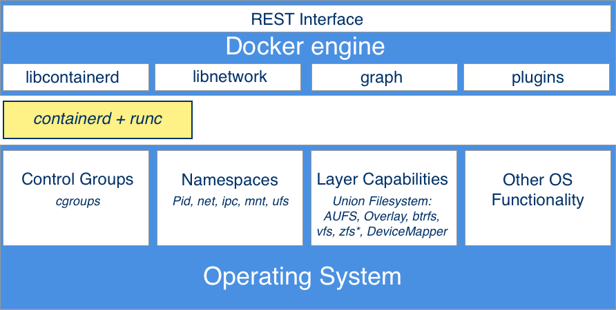

# Mastering Containers

## Starting, stopping, and removing containers

### example  

> `docker container run alpine echo "Hello World"`  

- explain:
  - `docker` is the name of the Docker **Command-Line Interface(CLI)** tool, which we are using to interact with the Docker engine that is responsible to run containers.
  - `container` indicates the context we are working with. As we want to run a container, our context is the word `container`.  
  - Next is the actual command we want to execute in the give context, which is `run`.
  - Let me recap-so far, we have `docker container run`, which means,*Hey Docker, i want to run a container.*
  - Now we also need to tell Docker which container to run. In this case, this is the so-called `alpine` container.
  - Finally, we need to define what kind of process or task shall be executed inside the container when it is running. In our case, this is `echo "Hello World"`.

- Anatomy of the docker container run expression

> practice：`docker container run centos ping -c 5 127.0.0.1`

### Running a random trivia question container

>- command：`wget -qO- http://jservice.io/api/random | jq .[0].question`  
>- The API that produces that free random trivia can be found at [http://jservice.io](http://jservice.io)  
>- `jq` is a handy tool often used to nicely filter and format JSON output, which increases the readability of it on the screen.  
>   - install：`brew install jq`  
>   - website：[https://stedolan.github.io/jq/manual/](https://stedolan.github.io/jq/manual/)  

- command： `docker container run -d --name trivia fundamentalsofdocker/trivia:ed2`  
  - `-d` tells Docker to run the process running in the container as a Linux daemon.
  - `--name` can be used to give the container an explicit name.

- To find out what is currently running on our host, we can use the `container ls` command, as follows:  

> `docker container ls`  

- If we want to list not only the currently running containers but all:  

> `docker container ls -a/--all`  

- Sometimes, we want to just list the IDs of all containers:  
  
> `docker container ls -q`  

- remove all the containers u have (Lean back and take a deep breath before you run this command):  
  
> `docker container rm -f $(docker container ls -a -q)`  

- You can invoke help for the list command as follows:  

> `docker container ls -h`  

- If we want to stop a container:  

> `docker container stop <container ID/name>`  

When you try to stop the trivia container, you will probably note that it takes a while until this command is executed. To be precise, it takes about 10 seconds. *Why is this the case*?  

Docker sends a Linux `SIGTERM` signal to the main process running inside the container. If the process doesn't react to the signal and terminate itself, Docker waits for 10 seconds and then sends `SIGKILL`, which will kill the process forcefully and terminate the container.  

- We want to get the ID of the trivia container, we can use this expression:  

> `export CONTAINER_ID=$(docker container ls -a | grep trivia | awk '{print $1}')`  

- Now, instead of using the container name, we can use the `$CONTAINER_ID` variable in our expression:  

> `docker container stop $CONTAINER_ID`  

Once we have stopped the container, it status changed to `Exited`.  

- If a container is stopped, it can be started again using the command:  

> `docker container start <container ID/name>`

- If we don't need containers anymore, then it is a good thing to remove them from memory; otherwise, they unnecessarily occupy precious resources.

> `docker container rm <container ID/name>`  

Sometimes, removing a container will not work as it is still running. If we want to force a removal, we can use:  

> `docker container rm -f/--force <container ID/name>`

## Inspecting containers

Containers are runtime instances of an image and have a lot of associated data that characterizes their behavior. To get more information about a specific container, we can use `inspect` command：  

> `docker container inspect <container ID/name>`  

Sometimes, we need just a tiny bit of the overall information, and to achieve this, we can either use the grep tool or a filter. The former method does not always result in the expected answer, so let's look into the latter approach:  

> `docker container inspect -f "{{json .State}}" trivia | jq .`  

The `-f` or `--filter` parameter is used to define the filter. The filter expression itself uses the Go template syntax. In this example, we only want to see the state part of the whole output in the JSON format.  

To nicely format the output, we pipe the result into the `jq` tool.  

## Exec into a running container

Sometimes, we want to run another process inside an already-running container. A typical reason could be to try to debug a misbehaving container.  

> `docker container exec -i -t trivia /bin/sh`  

The `-i` flag signifies that we want to run the additional process interactively, and `-t` tells Docker that we want it to provide us with a TTY (a Terminal emulator) for the command. Finally, the process we run is `/bin/sh`.  

Leave the container by pressing *Ctrl+D*.  

We cannot only execute additional processes interactive in a container.  

> `docker container exec trivia ps`  

We can even run processes as a daemon using the `-d` flag and define environment variables using the `-e` flag variables, as follows:  

> `docker container exec -it -e MY_VAR="Hello World" trivia /bin/sh`  

## Attaching to a running container

We can use the `attach` command to attach our Terminal's standard input, output, and error (or any combination of the three) to a running container using the ID or name of the container. Let's do this for our trivia container:  

> `docker container attach trivia`  

In this case, we will see every five seconds or so a new quote appearing in the output.  

## Retrieving container logs

- To access the logs of a given container, we can use the `docker container logs` command.  

> `docker container logs trivia`  

- If we want to get a few of the latest entries, we can use the `-t` or `--tail` parameter:  

> `docker container logs --tail 5 trivia`  

Sometimes, we want to follow the log that is produced by a container. This is possible when using the `-f` or `--follow` parameter. The following expression will output the last five log items and then follow the log as it is produced by the containerized process:  

> `docker container logs --tail 5 --follow trivia`  

### Logging drivers

Docker includes multiple logging mechanisms to help us to get information from running containers. These mechanisms are named **logging drivers**. Which logging driver is used can be configured at the Docker daemon level. The default logging driver is `json-file`. Some of the drivers that are currently supported natively are as follows:  

**Driver**|**Description**|
-|-|
`none`|No log output for the specific container is produced.  
`json-file`|This is the default driver. The logging information is stored in files, formatted as JSON.  
`journald`|If the journals daemon is running on the host machine, we can use this driver. If forwards logging to the `journald` daemon.  
`syslog`|If the `syslog` daemon is running on the host machine, we can configure this driver, which will forward the log messages to the `syslog` daemon.  
`gelf`|When using this driver, log messages are written to a **Graylog Extended Log Format (GELF)** endpoint. Popular examples of such endpoints are Graylog and Logstash.  
`fluentd`|Assuming that the `fluentd` daemon is installed on the host system, this driver writes log messages to it.  

> Note: If you change the logging driver, please be aware that the `docker container logs` command is only available for the `json-file` and `journald` drivers.  

We can also define the logging driver on a container by container basis use the `--log-driver` parameter:  

> `docker container run --name test -it --log-driver none busybox sh -c 'for N in 1 2 3; do eacho "Hello $N"; done'`  

### Advanced topic - changing the default logging driver

Commonly, Navigate to the `/etc/docker` folder and run `vi` as follows:  

> `vi daemon.json`  

After modify the file, Now we have to send a `SIGHUP` signal to the Docker daemon so that it picks up the changes in the configuration file:  

> `sudo kill -SIGHUP $(pidof dockerd)`  

Note that the preceding command only reloads the config file and does not restart the daemon.  

## Anatomy of containers

Many people wrongly compare containers to VMs. However, this is a questionable comparison. Containers are not just lightweight VMs.  

Containers are specially encapsulated and secured processes running on the host system. Containers leverage a log of features and primitives available in the Linux OS. The most important ones are *namespaces* and *cgroups*. All processes running in containers only share the same Linux kernel of the underlying host operating system. This is fundamentally different compared with VMs, as each VM contains its own full-blown operating system.  

### Architecture

  

In the lower part of the preceding diagram, we have the Linux operating system with its **cgroups**, **Namespaces**, and **Layer Capabilities** as well as **Other OS Functionality** that we do not need to explicitly mention here. Then, there is an intermediary layer composed of **containerd** and **runc**. On top of all that now sits the **Docker engine**. The **Docker engine** offers a RESTful interface to the outside world that can be accessed by any tool, such as the Docker CLI.  
