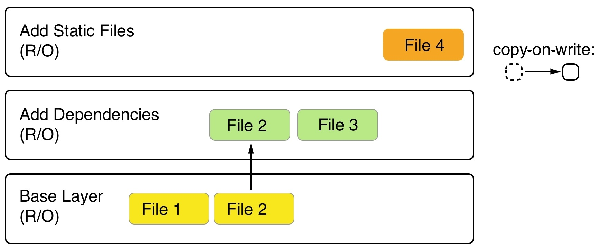

# Images

## What are images

### The layered filesystem

Container images are templates from which containers are created. These images are not made up of just one monolithic block but are composed of many layers. The first layer in the image is also called the base layer.

The layers of a container image are all immutable. Immutable means that once generated, the layer cannot ever be changed. The only possible operation affecting the layer is its physical deletion. This immutability of layers is important because it opens up a tremendous amount of opportunities, as we will see.  

Each layer only contains the delta of changes in regard to the previous set of layers.  

Since layers are immutable, they can be cached without ever becoming stale.  

### The writable container layer

As we have discussed, a container image is made of a stack of immutable or read-only layers. When the Docker Engine creates a container from such an image, it adds a writable container layer on top of this stack of immutable layers:  

  

Another advantage of the immutability of image layers is that they can be shared among many containers created from this image. All that is needed is a thin, writable container layer for each container, as shown in the following screenshot:  

  

This technique, of course, results in a tremendous reduction in the resources that are consumed. Furthermore, this helps to decrease the loading time of a container since only a thin container layer has to be created once the image layers have been loaded into the memory, which only happens for the first container.  

### Copy-on-write

Docker uses the copy-on-write technique when dealing with images. Copy-on-write is a strategy for sharing and copying files for maximum efficiency. If a layer uses a file or folder that is available in one of the low-lying layers, then it just uses it. If, on the other hand, a layer wants to modify, say, a file from a low-lying layer, then it first copies this file up to the target layer and then modifies it. In the following screenshot, we can see a glimpse of what this means:  

  

## Creating images

There are three ways to create a new container image on your system:

- The first one is by interactively building a container that contains all the additions and changes one desires, and then committing those changes into a new image.  
- The second, and most important, way is to use a `Dockfile` to describe what's in the new image, and then build the image using that `Dockfile` as a manifest.  
- Finally, the third way of creating an image is by importing it into the system from a tarball.  

### Interactive image creation

To interactively create an image follow along:  

> `docker container run -it --name sample alpine:3.10 /bin/sh`  

Inside the container, run the following command:  

> `apk update && apk add iputils`  

Now, we can indeed use `ping`, as the following command:  

> `ping -c 3 127.0.0.1`  

Once we have finished our customization, we can quit the container by typing `exit` at the prompt.

If we want to see what has changed in our container in relation to the base image, we can use the `docker container diff` command, as follows:  

> `docker container diff sample`  

The output should present a list of all modifications done on the filesystem of the container, as follows:  

```sh
C /usr
C /usr/sbin
A /usr/sbin/getcap
A /usr/sbin/ipg
...
A /var/cache/apk/APKINDEX.d8b2a6f4.tar.gz
```  

We have shortened the preceding output for better readability. In the list, `A` stands for *added*, and `C` stands for *changed*. If we had any delete files, then those would be prefixed with a `D`.  

We can now use the `docker container commit` command to persist our modifications and create a new image from them, like this:  

> `docker container commit sample my-alpine`  

With the preceding command, we have specified that the new image will be called `my-apline`.  

If we want to see how our custom image has been built, we can use the `history` command as follows:  

> `docker image history my-alpine`  

### Using Dockerfiles

Let's look at a sample `Dockerfile`, as follows:  

```dockerfile
FROM python:2.7
RUN mkdir -p /app
WORKDIR /app
COPY ./requirements.txt /app/
RUN pip install -r requirements.txt
CMD ["python", "main.py"]
```  

It is a convention to write the keywords in all caps, but that is not a must.  

Each line of the `Dockerfile` results in a layer in the resulting image.  

Now, let's look at the individual keywords in more detail.  

#### The `FROM` keyword

Every `Dockerfile` starts with the `FROM` keyword. with it, we define which base image we want to start building our custom image from. For example, if we want to start from scratch, we can use the following statement:  

> `FROM scratch`  
> This is useful in the context of building super-minimal images that only-for example-contain a single binary: The actual statically linked executable. `FROM scratch` is a `no-op` in the `Dockerfile`, and as such does not generate a layer in the resulting container image.  

#### The `RUN` keyword  

The argument for `RUN` is any valid Linux command. It is completely fine, and even recommended, for you to format a Linux command using more than one physical line, such as this:  

```sh
RUN apt-get update \
  && apt-get install -y --no-install-recommends \
    ca-certificates \
    libffi6 \
  && rm -rf /var/lib/apt/lists/*
```

If we use more than one line, we need to put a backslash(`\`) at the end of the lines to indicate to the shell that the command continues on the next line.  

#### The `COPY` and `ADD` keywords

These two keywords are used to copy files and folders from the host into the image that we're building. The two keywords are very similar, with the exception that the `ADD` keyword also lets us copy and unpack TAR files, as well as providing a URL as a source for the files and folders to copy.  

Let's look at a few examples of how these two keywords can be used, as follows:  

```dockerfile
COPY . /app
COPY ./web /app/web
COPY sample.txt /data/my-sample.txt
COPY ./sample* /mydir/
ADD smaple.tar /app/bin/
ADD http://example.com/sample.txt /data/
```

From a security perspective, it is important to know that, by default, all files and folders inside the image will have a **user ID**(**UID**) and a **group ID** (**GID**) of `0`. The good thing is that for both `ADD` and `COPY`, we can change the ownership that the files will have inside the image using the optional `--chown` flag, as follows:  

> `ADD --chown=11:22 ./data/web* /app/data/`  

Instead of numbers, one could also use names for the user and group, but then these entities would have to be already defined in the root filesystem of the image at `/etc/passwd` and `/etc/group` respectively; otherwise, the build of the image would fail.  

#### The `WORKDIR` keyword

The `WORKDIR` keyword defines the working directory or context that is used when a container is run from our custom image. for example:  

> `WORKDIR /app/bin`  

All activity that happens inside the image after the preceding line will use this directory as the working directory. It is very important to note that the following two snippets from a `Dockerfile` are not the same:  

> `RUN cd /app/bin`  
> `RUN touch sample.txt`  

Compare the preceding code with the following code:  

> `WORKDIR /app/bin`  
> `RUN touch sample.txt`  

The former will create the file in the root of the image filesystem, while the latter will create the file at the expected location in the `/app/bin` folder. Only the `WORKDIR` keyword sets the context across the layers of the image. The `cd` command alone is not persisted across layers.  

#### The `CMD` and `ENTRYPOINT` keywords

The `CMD` and `ENTRYPOINT` keywords are special. While all other keywords defined for a `Dockerfile` are executed at the time the image is built by the Docker builder, these two are actually definitions of what will happen when a container is started from the image we define. When the container runtime starts a container, it needs to know what the precess or application will be that has to run inside the container. That is exactly what `CMD` and `ENTRYPOINT` are used for-to tell Docker what the start process is and how to start that process.  

Now, the differences between `CMD` and `ENTRYPOINT` are subtle, and honestly, most users don't fully understand them or use them in the intended way. Luckily, in most cases, this is not a problem and the container will run anyway; it's just the handling of it that is not a straightforward as it could be.  

To better understand how to use the two keywords, let's analyze what a typical Linux command or expression looks like:  

> `ping -c 3 8.8.8.8`  

In the preceding expression, `ping` is the command and `-c 3 8.8.8.8` are the parameters to this command. Now that we have dealt with this, we can get back to `CMD` and `ENTRYPOINT`. `ENTRYPOINT` is used to define the command of the expression, which `CMD` is used to define the parameters for the command. Thus, a `Dockerfile` using Alpine as the base image and defining `ping` as the process to run in the container could look like this:  

> ```dockerfile
> FROM alpine:3.10  
> ENTRYPOINT ["ping"]  
> CMD ["-c", "3", "8.8.8.8"]  
> ```  

For both `ENTRYPOINT` and `CMD`, the values are formatted as a JSON array of strings, where the individual items correspond to the tokens of the expression that are separated by whitespace. This is preferred way of defining `CMD` and `ENTRYPOINT`. It is also called *exec* form.  

Alternatively, one can also use what's called the shell form, as shown here:  

> `CMD command param1 param2`  

We can now build an image called `pinger` from the preceding `Dockerfile`, as follows:  

> `docker image build -t pinger .`  

Then, we can run a container from the `pinger` image we just created, like this:  

> `docker container run --rm -it pinger`  

The beauty of this is that I can now override the `CMD` part that I have defined in the `Dockerfile` when I create a new container by adding the new values at the end of the `docker container run` expression, like this:  

> `docker container run --rm -it pinger -w 5 127.0.0.1`  

If we want to override what's defined in the `ENTRYPOINT` in the `Dockerfile`, we need to use the `--entrypoint` parameter:  

> `docker container run --rm -it --entrypoint pinger`  
> Note: If u leave `ENTRYPOINT` undefined, then it will have the default value of `/bin/sh -c`, and whatever the value of `CMD` is will be passed as a string to the shell command.  
> Further read: [Dockerfile keywords](https://docs.docker.com/engine/reference/builder/#entrypoint)  

### Multi-step builds

To demonstrate why a `Dockerfile` with multiple build steps is useful, let's make an example `Dockerfile`. Here is the code found inside the `hello.c` file:  

> ```c
> #include <stdio.h>
> int main(void)
> {
>     printf ("Hello, World!\n");
>     return 0;
> }
> ```

To containerize this application we first write a `Dockerfile` with the following content:  

> ```dockerfile
> FROM alpine:3.7
> RUN apk update &&
> apk add --update alpine-sdk
> RUN mkdir /app
> WORKDIR /app
> COPY . /app
> RUN mkdir bin
> RUN gcc -Wall hello.c -o bin/hello
> CMD /app/bin/hello
> ```  

Next, let's build this image:  

> `docker image build -t hello-world .`  

Once the build is done, we can list the image and see its size shown, as follows:  

> `docker image ls | grep hello-world`  
> hello-world   latest   e9b...   2 minutes ago   176MB  

The reason for it being so big is that the image not only contains the Hello World binary but also all the tools to compile and link the application from the source code.  But this is really not desirable when running the application, say, in production. Ideally, we only want to have the resulting binary in the image and not a whole SDK.  

It is precisely for this reason that we should define Dockerfiles as multi-stage. We have some stages that are used to build the final artifacts, and then a final stage, where we use the minimal necessary base image and copy the artifacts into it. This results in very small Docker images. Have a look at this revised `Dockerfile`:  

> ```dockerfile
> FROM alpine:3.7 AS build
> RUN apk update && \
>     apk add --update alpine-sdk
> RUN mkdir /app
> WORKDIR /app
> COPY . /app
> RUN mkdir bin
> RUN gcc hello.c -o bin/hello
> # This results in a single layer image
> FROM alpine:3.7
> # only copies the binary from the `build` stage, using the `--from` parameter.
> COPY --from=build /app/bin/hello /app/hello
> CMD /app/hello
> ```  

Let's build the image again and then you can check its size again:  

> `docker image build -t hello-world-small .`  
> `docker image ls | grep hello-world`  

### Saving and loading images

The third way to create a new container image is by importing or loading it from a file. A container image is nothing more than a tarball. To demonstrate this, we can use the `docker image save` command to export an existing image to a tarball, like this:  

> `docker image save -o ./backup/my-alpine.tar my-alpine`  

If, on the other hand, we have an existing tarball and want to import it as an image into our system, we can use as follows:  

> `docker image load -i ./backup/my-alpine.tar`  

## Sharing and shipping images

### Image namespaces

It is time to widen our horizon a bit and learn about how images are namespaced. The most generic way to define an image is by its fully qualified name, which looks as follows:  

> `<registry URL>/<User or Org>/<name>:<tag>`  

Let's look at an example, as follows:  

> `https://registry.acme.com/engineering/web-app:1.0`  

#### Pushing images to a registry

To be able to push an image to my personal account on Docker Hub, I need to tag it accordingly, as follows:  

> `docker image tag alpine: latest gaiheilukamei/alpine:1.0`  
> `docker login -u gaiheilukamei -p <my secret password`  
> `docker image push gaiheilukamei/alpine:1.0`

## Further reading

> Best practices for writing Dockerfiles, at [http://dockr.ly/22WiJiO](http://dockr.ly/22WiJiO)
> Using multi-stage builds, at [http://dockr.ly/2ewcUY3](http://dockr.ly/22WiJiO)
> About storage drivers, at [http://dockr.ly/1TuWndC](http://dockr.ly/22WiJiO)
> Graphdriver plugins, at [http://dockr.ly/2eIVCab](http://dockr.ly/22WiJiO)
> User-guided caching in Docker for Mac, at [http://dockr.ly/2xKafPf](http://dockr.ly/22WiJiO)