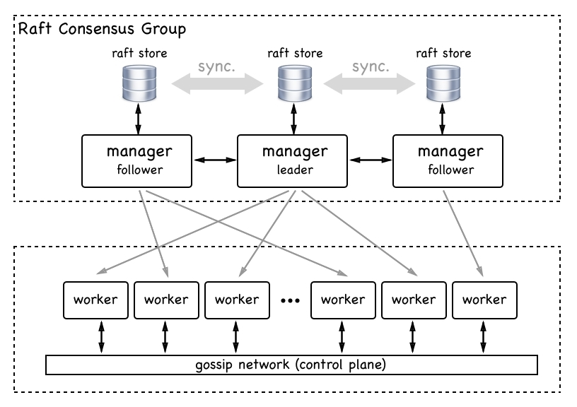

# Introduction to Docker Swarm

## The Docker Swarm architecture

The architecture of a Docker Swarm from a 30,000-foot view consists of two main parts——a raft consensus group of an odd number of manager nodes, and a group of worker nodes that communicate with each other over a gossip network, also called the control plane. The following diagram illustrates this architecture:  

  

If we have more than one manager node, then these nodes work together using the Raft consensus protocol. The Raft consensus protocol is a standard protocol that is often used when multiple entities need to work together and always need to agree with each other as to which activity to execute next.  

