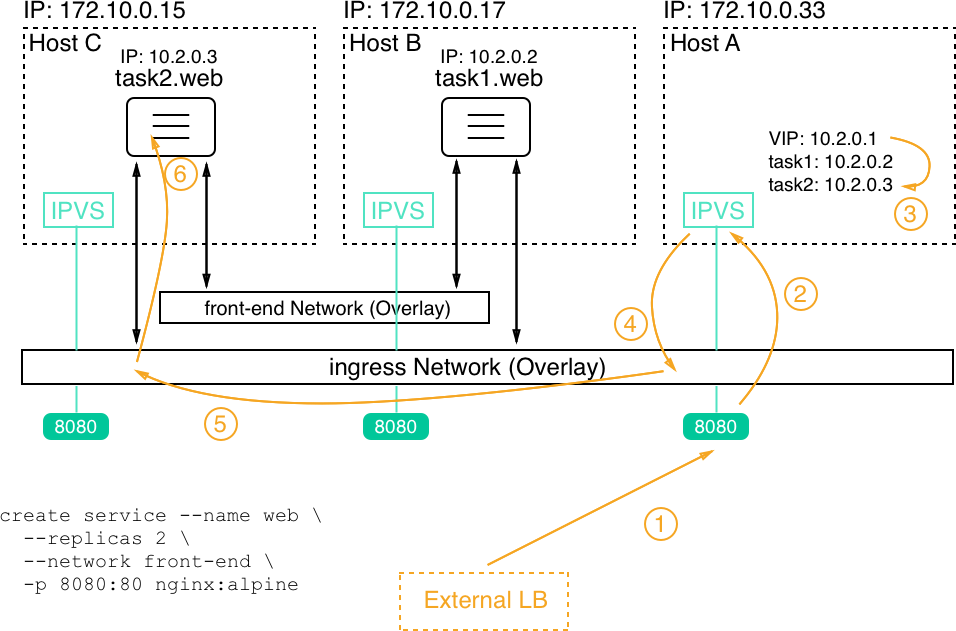

# Introduction to Docker Swarm

## The Docker Swarm architecture

The architecture of a Docker Swarm from a 30,000-foot view consists of two main parts——a raft consensus group of an odd number of manager nodes, and a group of worker nodes that communicate with each other over a gossip network, also called the control plane. The following diagram illustrates this architecture:  

  

If we have more than one manager node, then these nodes work together using the Raft consensus protocol. The Raft consensus protocol is a standard protocol that is often used when multiple entities need to work together and always need to agree with each other as to which activity to execute next.  

To work well, the Raft consensus protocol asks for an odd number of members in what is called the consensus group. All of the members of the consensus group communicate synchronously with each other.  

> To use more than five managers in a Swarm is hardly ever justified.  

Worker nodes communicate with each other over the so-called control plane. They use the gossip protocol for their communication. This communication is asynchronous, which means that, at any given time, it is likely that not all worker nodes are in perfect sync.  

To make sure the gossiping scales well in a large Swarm, each **worker** node only synchronizes its own state with three random neighbors.  

## Creating a Docker Swarm

### Creating a local single node swarm

Let's initialize a Swarm:  

> `docker swarm init`  

After an incredibly short time, you should see something like the following:  

```output
Swarm initialized: current node (cbiyveya2z2s9s05gl7pwxqu2) is now a manager.

To add a worker to this swarm, run the following command:

    docker swarm join --token SWMTKN-1-57dskf72myw5m696ohf5puecohul9k1hmkas41mwz6w1nlcm52-cr8yn50r9b9ndkom8wm76ewus 192.168.65.3:2377

To add a manager to this swarm, run 'docker swarm join-token manager' and follow the instructions.
```  

List all of the nodes of the Swarm:  

> `docker node ls`  

To get more information about a node, we can use the `docker node inspect` command:  

> `docker node inspect cbiyveya2z2s9s05gl7pwxqu2`  

### Creating a local Swarm in VirtualBox or Hyper-V

> `docker-machine ls`  
>  
> `docker-machine start default`  

If we do not have a VM yet, we can easily create one using the `create` command:  

> `docker-machine create --driver virtualbox default`  

Now, let's create five VMs for a five-node Swarm:  

```sh
$ for NODE in `seq 1 5`; do
  docker-machine create --driver virtualbox "node-${NODE}"
done
```  

Now, we're ready to build a Swarm. Technically, we could SSH into the first VM `node-1` and initialize a Swarm and then SSH into all the other VMs and join them to the Swarm leader. But this is not efficient. Let's again use a script that does all of the hard work:  

```sh
# get IP of Swarm leader
$ export IP=$(docker-machine ip node-1)

# init the Swarm
$ docker-machine ssh node-1 docker swarm init --advertise-addr $IP

# Get the Swarm join-token
$ export JOIN_TOKEN=$(docker-machine ssh node-1 \
    docker swarm join-token worker -q)
```  

Now that we have the join token and the IP address of the Swarm leader, we can ask the other nodes to join the Swarm as follows:  

```sh
$ for NODE in `seq 2 5`; do
  NODE_NAME="node-${NODE}"
  docker-machine ssh $NODE_NAME docker swarm join --token $JOIN_TOKEN $IP:2377
done
```  

To make the Swarm highly available, we can now promote, for example, `node-2` and `node-3` to become managers:  

> `docker-machine ssh node-1 docker node promote node-2 node-3`  

Finally, we can list all of the nodes of the Swarm:  

> `docker-machine ssh node-1 docker node ls`  

Let's pull all of our code snippets together and make the whole thing a bit more robust:  

```sh
alias dm="docker-mahcine"
for NODE in `seq 1 5`; do
  NODE_NAME=node-${NODE}
  dm rm --force $NODE_NAME
  dm create --driver virtualbox $NODE_NAME
done
alias dms="docker-machine ssh"
export IP=$(docker-machine ip node-1)
dms node-1 docker swarm init --advertise-addr $IP;
export JOIN_TOKEN=$(dms node-1 docker swarm join-token worker -q);
for NODE in `seq 2 5`; do
  NODE_NAME="node-${NODE}"
  dms $NODE_NAME docker swarm join --token $JOIN_TOKEN $IP:2377
done;
dms node-1 docker node promote node-2 node-3
```  

It is highly recommended best practice to always script and hence automate operations.  

## Deploying a first application  

We'll start by first creating a single service. For this, we need to SSH into one of the manager nodes. I select `node-1`:  

> `docker-machine ssh node-1`  

### Creating a service

Let's first look at a sample stack file that defines a single service:  

```yml
version: "3.7"
services:
  whoami:
    image: training/whoami:latest
    networks:
      - test-net
    ports:
      - 81:8000
    deploy:
      replicas: 6
      update_config:
        parallelism: 2
        delay: 10s
      labels:
        app: sample-app
        environment: prod-south

networks:
  test-net:
    driver: overlay
```

To create a service, we use the `docker stack deploy` command. Assuming that the file in which the preceding content is stored is called `stack.yaml`:  

> `docker stack deploy -c stack.yaml sample-stack`  

We can list all stacks on our Swarm:  

> `docker stack ls`  

We can also list the services defined in our Swarm:  

> `docker service ls`  

We can use `docker service ps` command get some deeper insight into replicas:  

> `docker service ps sample-stack_whoami`  

### Logs of a service

> `docker service logs sample-stack_whoami`  

### Deleting a service or a stack

> `docker stack rm sample-stack`  

It is important to note that the stopped containers are not removed from the Docker host. Hence, it is advised to purge containers from time to time on worker nodes to reclaim unused resources. Use `docker container purge -f` for this purpose.  

## The swarm routing mesh

  
