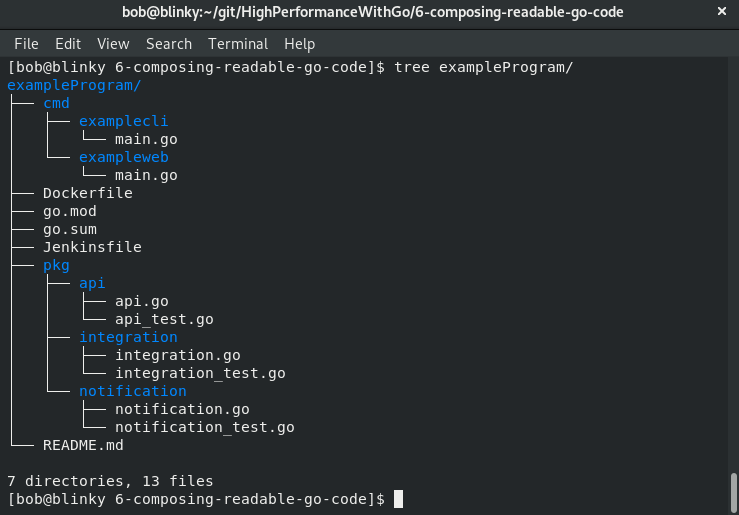

# Composing Readable Go Code

Style is often subjective, but the Go team has worded hard in order to write the language in an opinionated way and facilitate developer velocity, readability, and collaboration.

## Maintaining readability in Go

Readability is another core tenet of Go. Being able to quickly grok a new code base and understand some of its nuances is an important part of any programming language. As distributed systems continue to grow, with vendored libraries and APIs becoming more commonplace, being able to easily read the code that is included and be able to make sense of it is helpful for forward momentum. This also makes broken code easier to fix.  

Readability is one of the most important parameters of being able to maintain a large code base over an extended period of time, and this is one of the most important things that sets Go apart from its competitors. The language was constructed with readability as a first class citizen.  

## Exploring packaging in Go

We should try and keep the main package small in order to modularize all dependencies within our programs.  

### Package naming

While naming packages, developers should adhere to the following rules:  

> - Packages shouldn't have underscores, hyphens, or mixedCaps.
> - Packages shouldn't be named with generic naming schemes, such as common, util, base or helper.
> - Package naming should be related to the function that package is performing.
> - Packages should retain a decent-sized scope; all the elements in a package should have similar goals and objectives.
> - Utilizing internal packages can help while you're vetting new packages before they are aligned with your public API.

### Package layout

A common convention is to keep your main programs in a folder named `cmd`. Your other packages that you build to be executed from the `main` function should live in a `pkg` directory. The following a screenshot shows this separation:  

  

## Understanding naming in Go

There are a lot of consistent behaviors that Go programmers like to retain in order to keep readable, maintainable code. Go naming schemes tend to be consistent, accurate, and short. We want to create names with the following idioms in mind:  

> - Local variables for iterators should be short and simple:  
>   - `i` for an iterator; `i` and `j` if you have a two-dimensional iterator;
>   - `r` for a reader;
>   - `w` for a writer;
>   - `ch` for channels.  
> 
> - Global variable names should be short and descriptive:
>   - `RateLimit`
>   - `Log`
>   - `Pool`
> 
> - Acronyms should follow the convention of using all capitals:
>   - `FooJSON`
>   - `FooHTTP`
> 
> - Avoid stuttering with the package name:
>   - `log.Error()` instead of `log.LogError()`
> 
> - Interfaces with one method should follow the method name plus the `-er` suffix:
>   - `Stringer`
>   - `Reader`
>   - `Logger`
> 
> - Names in Go should follow a Pascal or mixedCaps case method:
>   - `var ThingOne`
>   - `var thingTwo`

## Understanding formatting in Go

We can also add a pre-commit hook to our Git repository (in `./git/hooks/pre-commit`) in order to corroborate the fact that all of the code that is being committed to a repository is formatted as expected. The following code block illustrates this:  

```sh
#!/bin/bash
FILES=$(/usr/bin/git diff --cached --name-only --diff-filter=dr | grep '\.go$')
[ -z "$FILES" ] && exit 0
FORMAT=$(gofmt -l $FILES)
[ -z "$FORMAT" ] && exit 0

echo >&2 "gofmt should be used on your source code. Please execute:"
  for gofile in $FORMAT; do
      echo >&2 " gofmt -w $PWD/$gofile"
  done
  exit 1
```  

After we add this pre-commit hook, we can confirm that things are working as expected by adding some erroneous spacing to a file within our repository. After we do so and `git commit` our code, we will see a warning message as follows:  

```
git commit -m "test"
//gofmt should be used on your source code. Please execute:
gofmt -w /home/bob/go/example/badformat.go
```

`gofmt` also has a lesser known but vastly helpful simplify method, which will perform source transformations where possible. This will take some of the composite, slice and range composite literals, and shorten them. The simplify formatting command will take the following code:  

```go
package main
import "fmt"
func main() {
    var tmp = []int{1, 2, 3}
    b := tmp[1:len(tmp)]
    fmt.Println(b)
    for i, _ := range tmp {
       fmt.Println(tmp[i])
    }
}
```

This will simplify to the following code: `gofmt -s gofmtSimplify.go`.  

The output of the `gofmt` code snippet is as follows:

```go
package main
import "fmt"
func main() {
    var tmp = []int{1, 2, 3}
    b := tmp[1:]
    fmt.Println(b)
    for i := range tmp {
       fmt.Println(tmp[i]) 
    }
}
```

## Briefing on interfaces in Go

Go's interfacing system is different from the interfacing systems in other languages. They are named collections of methods. Interfaces are important in composing reading Go code because they make the code scalable and flexible. Interfaces also give us the ability to have polymorphism(providing a single interface to items with different types) in Go. Another positive aspect of interfaces is that they are implicitly implemented——the complier checks that a specific type implements a specific interface.  

## Comprehending methods in Go

Methods in GO are functions that have a special type, called a `receiver`, that sits between the `function` keyword and the method name associated with the keyword. Go doesn't have classes in the same manner that other programming languages do. Structs are often used in conjunction with methods in order to bundle data and its corresponding methods in a similar fashion to how classes are constructed in other languages. As we instantiate a new method, we can add struct values in order to enrich the function call.  

Methods can also have pointer receivers. Pointer receivers are helpful when you would like to update the data in place and have the results available to the caller function. This is important to remember when attempting to mutate state from within method calls. Methods are very helpful in manipulating data in Go programs.

## Comprehending inheritance in Go

Go does not have inheritance. Composition is used in order to embed items (mostly structs) in one another. This is convenient when you have a baseline struct that is used for many different functions, with other structs that build on top of the initial struct.  

## Exploring reflection in Go

Reflection in Go is a form of metaprogramming. Using reflection in Go lets the program understand its own structure. There are times when you want to use a variable at runtime that doesn't exist when the program was composed. We use reflection to check the key and value pair that is stored within an interface variable. Reflection is not often clean, so be wary of using it——it should be used in special cases when necessary. It only has runtime checks(not compile checks), so we need to use reflection with common sense.  

There are three important pieces of reflection that are used in order to find out information:  

> - Types
> - Kinds
> - Values

These three different pieces all work together to deduce the information you might need to know in relation to an interface. Let's take a look at each one individually and see how they mesh together.  

```go
func main() {
    i := []string{"foo", "bar", "baz"}
    ti := reflect.TypeOf(i)
    fmt.Println(ti.Kind())

    example := "foo"
    exampleVal := reflect.ValueOf(example)
    fmt.Println(exampleVal)
}
```

### Types

If, instead of validating the string, we are looking at an incoming network call or the return from an external library call, or trying to build a program that can handle different types, the reflection library's `TypeOf` definition can help us to identify these types correctly.  

### Kinds

A kinds is used as a placeholder to define the kind of type that a specific type represents. It is used to denote what the type is made of. This is very useful in determining what sort of structure has been defined.  

This can be useful if we want to deduce the type of a particular interface.

### Values

Values in reflection help to read, set, and store results on particular variables.