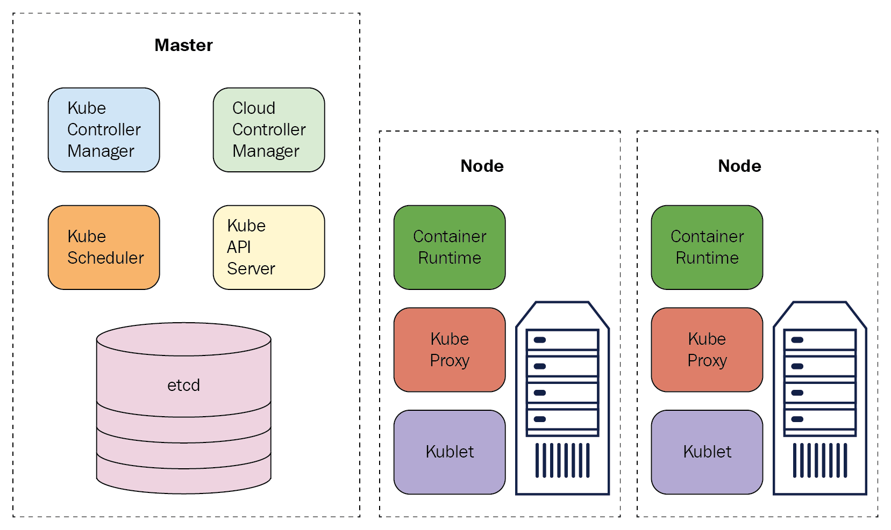
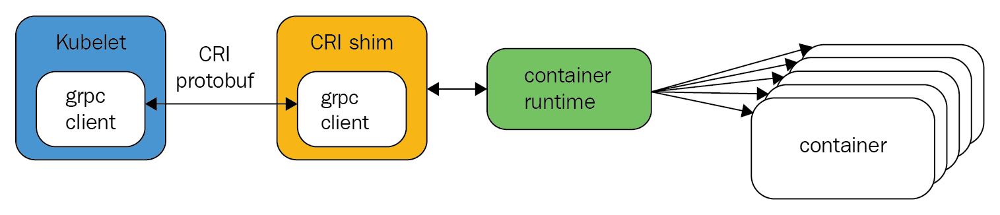

# Introduction to Kubernetes for Developers

> - [Installing Docker](https://docs.docker.com/install/#supported-platforms)  
> - [Installing kubectl](https://kubernetes.io/docs/tasks/tools/install-kubectl/)  
> - [Installing Minikube](https://kubernetes.io/docs/tasks/tools/install-minikube/)  

## Understanding the Kubernetes architecture

Kubernetes is a marvel of software engineering. The architecture and design of Kubernetes are a big part in its success. Each cluster has a **control plane** and **data plane**.  

Here is a diagram that illustrates the overall architecture:  

  

### The control plane

The control plane consists of several components:  

> - **API server**: The **kube-api-server** is a massive **REST** server that exposes the Kubernetes API to the world. You can have multiple instances of the API server in your control plane for high-availability. The API server keeps the cluster state in etcd.  
>  
> - **The etcd metadata store**: The complete cluster is stored in etcd([https://coreos.com/etcd/](https://coreos.com/etcd/)), a consistent and reliable, distributed key-value store. It is common to have three or five instances of etcd for redundancy. If you lose the data in your etcd store, you lose your cluster.  
>  
> - **Scheduler**: The **kube-scheduler** is responsible for scheduling pods to worker nodes. It implements a sophisticated scheduling algorithm that takes a lot of information into account.  
>  
> - **Controller manager**: The **kube-controller manager** is a single process that contains multiple controllers for simplicity. These controllers watch for events and changes to the cluster and respond accordingly:  
>   - **Node controller**: Responsible for noticing and responding when nodes go down.  
>   - **Replication controller**: This makes sure that there is the correct number of pods for each replica set or replication controller object.  
>   - **Endpoints controller**: This assigns for each service an endpoints object that lists the service's pods.  
>   - **Service account and token controllers**: These initialize new namespaces with default service accounts and corresponding API access tokens.  
> - **Cloud controller manager**  

### The data plane

The data plane is the collection of the nodes in the cluster that run your containerized workloads as pods. There are several components that Kubernetes installs on each node in order to communicate, watch, and schedule pods: kubelet, kube-proxy, and the container runtime(for example, the Docker daemon).  

#### The kubelet

The kubelet is a Kubernetes agent. It's responsible for talking to the API server and dor running that managing the pods on the node. Here are some of the responsibilities of the kubelet:  

> - Downloading pod secrets from the API server  
> - Mounting volumes  
> - Running the pod container via the **Container Runtime Interface(CRI)**  
> - Report the status of the node and each pod  
> - Probe container liveness  

#### The kube proxy

The kube proxy is responsible for the networking aspects of the node. It operates as a local front services and can forward TCP and UDP packets. It discovers the IP addresses of services via DNS or environment variables.  

#### The container runtime

Kubernetes eventually runs containers, even if they are organized in pods. Kubernetes supports different container runtimes. Originally, only Docker was supported. Now, Kubernetes runs containers through an interface called **CRI**, which is based on **gRPC**:  

  

Each container runtime that implements CRI can be used on a node controlled by the **kubelet**.  

#### Kubectl

**Kubectl** is a tool you should get very comfortable with. Here is a short list of the capabilities kubectl puts literally at your fingertips:  

> - CLuster management  
> - Deployment  
> - Troubleshooting and debugging  
> - Resource management (Kubernetes objects)  
> - Configuration and metadata  

## Kubernetes and microservices — a perfect match

Here is a Kubernetes deployment manifest:  

```yaml
apiVersion: apps/v1
kind: Deployment
metadata:
  name: nginx
  labels:
    app: nginx
spec:
  replicas: 3
  selector:
    matchLabels:
      app: nginx
  template:
    metadata:
      labels:
        app: nginx
    spec:
      containers:
        - name: nginx
          image: nginx:1.15.4
          ports:
            - containerPort: 80
  resources:
    requests:
      cpu: 500m
```  

This is a YAML file ([https://yaml.org/](https://yaml.org/)) that has some fields that are common to all Kubernetes resources, and some fields that are specific to deployments. Let's break this down piece by piece. Almost everything you learn here will apply to other resources:  

> The `apiVersion` field marks the Kubernetes resources version. A specific version of the Kubernetes API server can work with different versions of different resources. Resource versions have two parts: an API group (in this case, `apps`) and a version number (`v1`). The version number may include **alpha** or **beta** designations.  
>  
> The `kind` field specifies what resource or API object we are dealing with.  
>  
> The `metadata` section contains the name of the resource (`nginx`) and a set of labels, which are just key-value string pairs. The name is used to refer to this particular resource. The labels allow for operating on a set of resources that share the same label. Labels are very useful and flexible. In this case, there is just one label (`app: nginx`).  
>  
> Next, we have the `spec` field. This is a ReplicaSet `spec`. You could create a ReplicaSet directly, but it would be static. The whole purpose of deployments is to manage its set of replicas. What's in a ReplicaSet spec? Obviously, it contains the number of `replicas` (`3`). It has a `selector` with a set of `matchLabels`, and it has a pod template. The ReplicaSet will manage pods that have labels that match `matchLabels`.  
>  
> Let's have a look at the pod template. The template has two parts: `metadata` and a `spec`. The `metadata` is where you specify the labels. The `spec` describes the `containers` in the pod. There are may be one or more containers in a pod. The key field for a container is the image (often a Docker image), where you packaged your microservice. That's the code we want to run.  

There are more fields that are optional. If you want to dive in deeper, check out the API reference for the deployment resource at [https://kubernetes.io/docs/reference/generated/kubernetes-api/v1.18/#deployment-v1-apps](https://kubernetes.io/docs/reference/generated/kubernetes-api/v1.18/#deployment-v1-apps)  

### Exposing and discovering microservices

We deployed microservice with a deployment. Now, we need to expose it, so that it can be used by other services in the cluster and possibly also make it visible outside the cluster. Kubernetes provides the `Service` resource for that purpose. Kubernetes services are backed up by pods, identified by labels:  

```yaml
apiVersion: v1
kind: Service
metadata:
  name: nginx
  labels:
    app: nginx
spec:
  ports:
  - port: 80
    protocol: TCP
  selector:
    app: nginx
```  

Services discover each other inside the cluster, using DNS or environment variables. This is the default behavior. But, if you want to make a service accessible to the world, you will normally set an ingress object or a load balancer.  

### Scaling microservices

Kubernetes provides horizontal pod autoscaling, which is based on CPU, memory, or custom metrics, and can scale your service up and down automatically.  

Here is how to scale our `nginx` deployment that is currently fixed at three replicas to go between `2` and `5`, depending on the average CPU usage across all instances:  

```yaml
apiVersion: autoscaling/v1
kind: HorizontalPodAutoscaler
metadata:
  name: nginx
  namespace: default
spec:
  maxReplicas: 5
  minReplicas: 2
  targetCPUUtilizationPercentage: 90
  scaleTargetRef:
    apiVersion: v1
    kind: Deployment
    name: nginx
```  

The outcome is that Kubernetes will watch CPU utilization of the pods that belong to the `nginx` deployment. When the average CPU over a certain period of time (5 mins, by default) exceeds 90%, it will add more replicas until the maximum of 5, or until utilization drops below 90%. The HPA can scale down too, but will always maintain a minimum of two replicas, even if the CPU utilization is zero.  

## Creating a local cluster

Minikube supports multiple versions of Kubernetes:  

> `minikube start --driver=virtualbox --kubernetes-version=v1.18.3`  

### Playing with your cluster

```sh
# check your Minikube version
minikube version

# examining our node
kubectl get nodes

# here are all the namespace
kubectl get ns

# to see all the services in all the namespaces, you can use `--all-namespaces` flag
kubectl get svc --all-namespaces

# to explore the dashboard, you can run the dedicated Minikube command
minikube dashboard
```  

### Installing Helm

Helm is the Kubernetes package manager. It has two components: a server-side component called `tiller`, and a CLI called `helm`.  

Install `helm`:  

> `brew install kubernetes-helm`  

Once you have Helm already, you can add a chart repository. One popular starting location is the official Helm stable charts ([https://helm.sh/docs/intro/quickstart/#initialize-a-helm-chart-repository](https://helm.sh/docs/intro/quickstart/#initialize-a-helm-chart-repository)):  

> `helm repo add stable https://kubernetes-charts.storage.googleapis.com/`  
